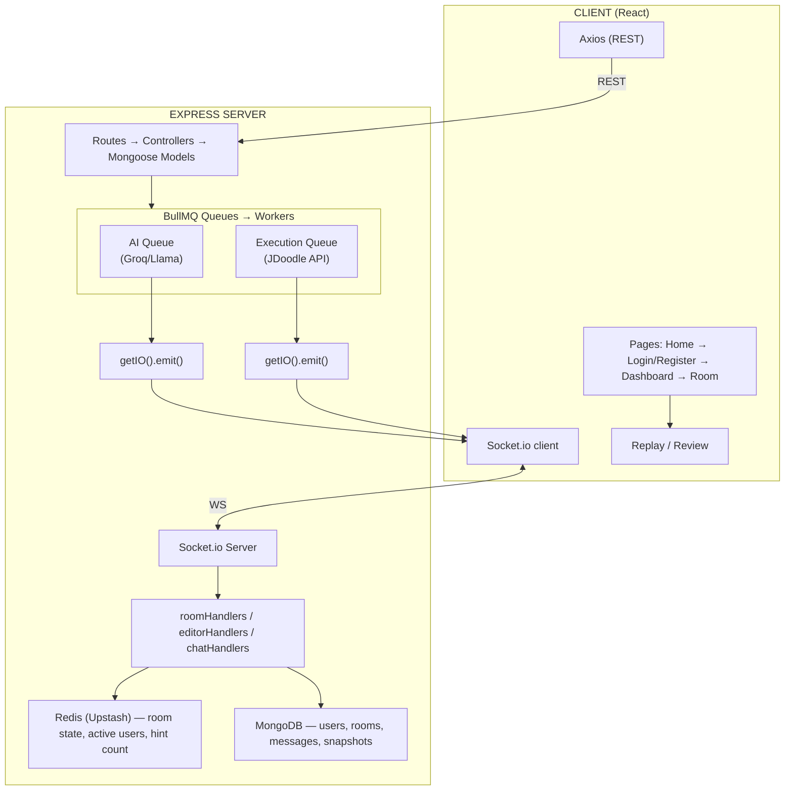

# CodeRoom

A full-stack real-time collaborative coding interview platform. Interviewers create sessions, candidates join via a 6-character code, and both collaborate in a shared Monaco editor with live cursor sync, real-time chat, AI-powered hints, code execution, session replay, and post-session AI code review.

---

## Table of Contents

- [Features](#features)
- [Tech Stack](#tech-stack)
- [Architecture Overview](#architecture-overview)
- [Project Structure](#project-structure)
- [Design Patterns](#design-patterns)
- [Data Flow](#data-flow)
- [API Reference](#api-reference)
- [Socket Events](#socket-events)
- [Role-Based Access Control](#role-based-access-control)
- [AI Pipeline](#ai-pipeline)
- [Environment Variables](#environment-variables)
- [Getting Started](#getting-started)

---

## Features

| Feature | Description |
|---|---|
| Real-time collaborative editor | Monaco Editor with live code sync and remote cursor display via Socket.io |
| Role-based sessions | Interviewers create and end rooms; candidates join via code |
| Multi-language support | JavaScript, Python, C++, Java, Go |
| Code execution | JDoodle API via BullMQ job queue with stdin support |
| AI Hints | Groq/Llama sends structured directional hints to candidate (3 per session limit) |
| Interviewer Copilot | AI generates follow-up questions based on candidate's live code |
| Post-session review | AI generates structured hire/no-hire verdict with complexity analysis |
| Session Replay | Snapshots captured on every execution; scrub through the full session |
| Real-time chat | Persistent chat with typing indicators |
| Waiting lobby | Both roles see a waiting screen until the other joins |
| Session end notification | Candidate is auto-redirected to dashboard when interviewer ends the session |

---

## Tech Stack

### Client
| Layer | Technology |
|---|---|
| Framework | React 18 + Vite |
| Routing | React Router v6 |
| Editor | Monaco Editor (`@monaco-editor/react`) |
| Real-time | Socket.io client |
| Styling | Tailwind CSS (custom design token system) |
| HTTP | Axios |
| State | React Context (AuthContext) + local component state |

### Server
| Layer | Technology |
|---|---|
| Runtime | Node.js + Express |
| Real-time | Socket.io |
| Database | MongoDB (Mongoose ODM) |
| Cache / State | Upstash Redis (ioredis) |
| Job Queue | BullMQ (separate Redis connection) |
| Auth | JWT (access token) + Redis token blacklist |
| AI | Groq SDK — `llama-3.3-70b-versatile` |
| Code Execution | JDoodle REST API |
| Snapshot Cron | node-cron (periodic snapshot capture) |

---

## Architecture Overview



### Key Architectural Decisions

**Why BullMQ for AI and execution?**
Both Groq and JDoodle calls can take 3–15 seconds. Handling them synchronously in a route handler would block the event loop and time out under load. BullMQ offloads them to background workers with retry logic. Results are pushed back to clients via Socket.io from inside the worker using `getIO()`.

**Why Redis for room state?**
Room code, language, and active users need to be available instantly when a new socket joins mid-session. MongoDB would add latency and unnecessary writes on every keystroke. Redis acts as an in-memory session store — code is written to Redis on every `editor:change`, and MongoDB is the persistent record (snapshots, room metadata, messages).

**Why separate BullMQ Redis from app Redis?**
BullMQ requires specific Redis commands and connection behaviour that conflicts with general key-value usage patterns. Two separate connections prevent interference.

---

## Project Structure

```
CodeRoom/
├── client/                          # React + Vite frontend
│   └── src/
│       ├── api/
│       │   └── axios.js             # Axios instance with base URL + auth header
│       ├── components/
│       │   ├── ProtectedRoute.jsx   # Redirects unauthenticated users
│       │   └── room/
│       │       ├── RoomHeader.jsx   # Top bar: language picker, Run, Hint, Copilot, End
│       │       ├── ChatPanel.jsx    # Real-time chat with typing indicator
│       │       ├── ExecutionPanel.jsx  # Stdin input + stdout/stderr display
│       │       ├── HintPanel.jsx    # Structured AI hint display
│       │       └── CopilotPanel.jsx # Interviewer follow-up questions
│       ├── context/
│       │   └── AuthContext.jsx      # JWT decode + login/register/logout + localStorage
│       ├── pages/
│       │   ├── Home.jsx             # Landing page
│       │   ├── Login.jsx            # Email + password sign in
│       │   ├── Register.jsx         # Name, email, password, role picker
│       │   ├── Dashboard.jsx        # Create/join room, session history
│       │   ├── Room.jsx             # Main interview room (editor + panels)
│       │   ├── Replay.jsx           # Snapshot scrubber (interviewer only)
│       │   └── Review.jsx           # AI code review (interviewer only)
│       ├── socket/
│       │   └── socket.js            # Socket.io singleton with lazy init
│       └── App.jsx                  # Routes + AuthGate loading state
│
└── server/                          # Node.js + Express backend
    └── src/
        ├── config/
        │   ├── db.js                # Mongoose connect
        │   ├── redis.js             # Upstash ioredis (app state)
        │   ├── bullmqRedis.js       # BullMQ Redis connection
        │   └── env.js               # Env validation
        ├── middleware/
        │   ├── verifyToken.js       # JWT verify + Redis blacklist check
        │   ├── rateLimiter.js       # express-rate-limit
        │   └── errorHandler.js      # Global error handler
        ├── models/
        │   ├── User.model.js        # name, email, password (bcrypt), role
        │   ├── Room.model.js        # roomId, joinCode, status, language, codeReview
        │   ├── Message.model.js     # roomId, senderId, text, type
        │   └── Snapshot.model.js    # roomId, code, language, timestamp, triggeredBy
        ├── controllers/
        │   ├── auth.controllers.js  # register, login, logout, refresh
        │   └── room.controller.js   # createRoom, joinRoom, endRoom, getMyRooms
        ├── routes/
        │   ├── auth.routes.js
        │   ├── room.routes.js       # interviewerOnly guard on /end
        │   ├── execution.routes.js  # Enqueues to executionQueue
        │   ├── ai.routes.js         # hint (3/session limit), review, followup, explain
        │   └── session.routes.js    # Snapshots (interviewer only)
        ├── queues/
        │   ├── aiQueue.js           # BullMQ queue: 2 attempts, exponential backoff
        │   ├── executionQueue.js    # BullMQ queue for code execution
        │   └── snapshotQueue.js     # BullMQ queue for snapshot capture
        ├── workers/
        │   ├── aiWorker.js          # Groq API call → socket emit ai:hint/review/followup
        │   ├── executionWorker.js   # JDoodle API call → socket emit execution:result
        │   ├── snapshotWorker.js    # Reads Redis code → saves Snapshot to MongoDB
        │   └── snapshotCron.js      # Periodic snapshot trigger (node-cron)
        ├── socket/
        │   ├── index.js             # Socket.io server init, JWT middleware, getIO()
        │   ├── roomHandlers.js      # join, leave, problem:set, active users
        │   ├── editorHandlers.js    # editor:change (Redis write + broadcast), cursor:move
        │   └── chatHandlers.js      # chat:message (MongoDB persist + broadcast), typing
        └── app.js                   # Express app, middleware, routes, server bootstrap
```

---

## Design Patterns

### 1. Singleton Socket (Client)
`socket/socket.js` exports `getSocket()`, `connectSocket()`, `disconnectSocket()`. A single Socket.io client instance is created once and reused. The auth token is refreshed on each `getSocket()` call from localStorage, so a token refresh doesn't require reconnecting.

```js
// Lazy init — socket created once, reused everywhere
export const getSocket = () => {
  if (!socket) socket = io(VITE_SOCKET_URL, { auth: { token }, autoConnect: false })
  socket.auth = { token: localStorage.getItem('accessToken') }
  return socket
}
```

### 2. Worker Pattern (Server)
AI and code execution follow a producer-consumer pattern via BullMQ:
- **Producer**: REST route handler validates input, enqueues job, returns `{ status: 'queued' }` immediately
- **Consumer**: Worker process picks up job, calls external API, emits result via Socket.io
- **Result delivery**: `getIO().to(roomId).emit(...)` or targeted to a specific socket for role-specific results

This decouples HTTP response time from external API latency entirely.

### 3. Redis as Session Layer
Room state (code, language, active users, hint count) lives in Redis during the session lifetime:

```
room:{roomId}          → hash: { code, language, status, creatorId, problemStatement }
room:{roomId}:users    → set: [ userId1, userId2 ]
room:{roomId}:hintCount → integer (expires with room TTL)
blacklist:{token}      → string (for logout invalidation)
```

MongoDB stores permanent records — room metadata, messages, snapshots. Redis stores hot session state.

### 4. Remote Cursor via Monaco Decorations
Cursor positions are emitted via `cursor:move` socket event and rendered using Monaco's `deltaDecorations` API with custom inline CSS classes. Decorations are tracked in a ref and replaced (not appended) on each update to avoid stacking.

### 5. Optimistic Local State for Editor
`isRemoteChange` ref prevents echo loops: when a remote `editor:change` arrives, the flag is set before `setCode()`. The `handleCodeChange` callback checks the flag and skips re-emitting if it's a remote update.

```js
socket.on('editor:change', ({ code }) => {
  isRemoteChange.current = true  // mark as remote
  setCode(code)
})

const handleCodeChange = (value) => {
  if (isRemoteChange.current) { isRemoteChange.current = false; return }
  setCode(value)
  getSocket().emit('editor:change', { roomId, code: value })
}
```

### 6. Language Persistence with Code Switching
Each language's code is saved to a `savedCode` ref keyed by language name. Switching language restores that language's last code instead of clearing the editor.

### 7. JWT + Redis Blacklist Auth
Access tokens are short-lived JWTs. On logout, the token is added to a Redis blacklist key. Every authenticated request checks the blacklist before processing — this gives instant logout invalidation without needing refresh token rotation complexity.

### 8. Role-Based Access (Two Layers)
Access control is enforced at two layers:

- **Server**: `interviewerOnly` middleware on `/rooms/:id/end` and `/sessions/:id/snapshots`; `req.user.role` check in AI routes for followup
- **Client**: `useEffect` role guards in `Replay.jsx` and `Review.jsx` redirect candidates immediately; Dashboard conditionally renders Create Room; Room page conditionally renders tabs and lobby UI

---

## Data Flow

### Session Lifecycle

```
Interviewer: POST /api/rooms/create
  → Room created in MongoDB (status: waiting)
  → Redis hash initialized with code:'', language, status
  → Returns roomId + joinCode

Interviewer: socket emit room:join
  → Joins socket.io room
  → Gets current Redis state
  → Broadcasts room:userJoined
  → Waiting lobby shown (activeUsers < 2)

Candidate: POST /api/rooms/join (joinCode)
  → Room status → active in MongoDB
  → Returns roomId

Candidate: socket emit room:join
  → Joins socket.io room
  → Gets current Redis state (picks up interviewer's code/problem)
  → Lobby dismissed for both (activeUsers = 2)

--- Session Active ---

editor:change → Redis write + broadcast to room (excluding sender)
cursor:move → broadcast to room (excluding sender)
chat:message → MongoDB persist + broadcast to room
language:change → Redis write + broadcast to room
problem:set → MongoDB + Redis write + broadcast to room

--- Code Execution ---

POST /api/execution/run
  → executionQueue.add(job)
  → HTTP 200 { status: 'queued' }

executionWorker picks up job:
  → JDoodle API call
  → getIO().to(roomId).emit('execution:result', payload)
  → snapshotQueue.add('snapshot', { triggeredBy: 'execution' })

snapshotWorker picks up:
  → Reads current code from Redis
  → Saves Snapshot document to MongoDB

--- AI Hint ---

POST /api/ai/hint
  → Redis INCR hint count (max 3 per session)
  → aiQueue.add({ type:'hint', roomId, code, problem, targetUserId })

aiWorker picks up:
  → Groq API call (llama-3.3-70b-versatile)
  → Finds target socket in room
  → socket.emit('ai:hint', { result })
  → Client: setHint(result), setActiveTab('hint')

--- Session End ---

Interviewer: POST /api/ai/review (queued async)
Interviewer: PATCH /api/rooms/:id/end
  → Room status → ended in MongoDB + Redis
  → getIO().to(roomId).emit('room:ended')
  → Candidate receives room:ended → navigate('/dashboard')
  → Interviewer navigates to /dashboard

--- Post Session ---

Interviewer: GET /api/sessions/:roomId/snapshots (interviewer only)
  → Returns all snapshots sorted by timestamp
  → Replay page scrubs through them

Interviewer: GET /api/rooms/:roomId
  → Returns room.codeReview (written by aiWorker after review job)
  → Review page renders structured analysis
```

---

## API Reference

### Auth `POST /api/auth/*`
| Endpoint | Body | Response |
|---|---|---|
| `POST /register` | `{ name, email, password, role }` | `{ accessToken, user }` |
| `POST /login` | `{ email, password }` | `{ accessToken, user }` |
| `POST /logout` | — | `{ message }` |

### Rooms `(all require Bearer token)`
| Endpoint | Role | Body | Response |
|---|---|---|---|
| `POST /api/rooms/create` | interviewer | `{ language }` | `{ roomId, joinCode, expiresAt }` |
| `POST /api/rooms/join` | any | `{ joinCode }` | `{ roomId, language, status }` |
| `GET /api/rooms/my` | any | — | `Room[]` |
| `GET /api/rooms/:roomId` | any | — | `Room` |
| `PATCH /api/rooms/:roomId/end` | interviewer only | — | `{ message }` |
| `PATCH /api/rooms/:roomId/extend` | interviewer | — | `{ expiresAt }` |

### Execution
| Endpoint | Body | Response |
|---|---|---|
| `POST /api/execution/run` | `{ roomId, code, language, stdin }` | `{ status: 'queued' }` |

### AI
| Endpoint | Role | Body | Response |
|---|---|---|---|
| `POST /api/ai/hint` | any (3/session) | `{ roomId, code, problem }` | `{ status, hintsUsed, hintsRemaining }` |
| `POST /api/ai/review` | any | `{ roomId, code, language }` | `{ status: 'queued' }` |
| `POST /api/ai/followup` | interviewer only | `{ roomId, code, problem }` | `{ status: 'queued' }` |
| `POST /api/ai/explain` | any | `{ roomId, code }` | `{ status: 'queued' }` |

### Sessions
| Endpoint | Role | Response |
|---|---|---|
| `GET /api/sessions/:roomId/snapshots` | interviewer only | `{ roomId, total, snapshots[] }` |

---

## Socket Events

### Client → Server
| Event | Payload | Description |
|---|---|---|
| `room:join` | `{ roomId }` | Join socket room, receive current state |
| `room:leave` | — | Leave socket room, update active users |
| `editor:change` | `{ roomId, code }` | Broadcast code change + write to Redis |
| `cursor:move` | `{ roomId, position, color }` | Broadcast cursor position |
| `language:change` | `{ roomId, language }` | Change language for whole room |
| `problem:set` | `{ roomId, problemStatement }` | Interviewer sets problem (saved to DB + Redis) |
| `chat:message` | `{ roomId, text }` | Send chat message (persisted to MongoDB) |
| `chat:typing` | `{ roomId }` | Broadcast typing indicator |

### Server → Client
| Event | Payload | Description |
|---|---|---|
| `room:joined` | `{ code, language, problemStatement }` | Initial room state on join |
| `room:activeUsers` | `{ users: string[] }` | Updated user list after join/leave |
| `room:userJoined` | `{ userId, role }` | Another user joined |
| `room:userLeft` | `{ userId }` | Another user left |
| `room:ended` | `{ message }` | Interviewer ended session — candidate redirects |
| `room:error` | `{ message }` | Room not found or access denied |
| `editor:change` | `{ code }` | Remote code update |
| `cursor:move` | `{ userId, position, color }` | Remote cursor position |
| `language:change` | `{ language }` | Language changed by other user |
| `problem:set` | `{ problemStatement }` | Problem updated |
| `chat:message` | `{ senderId, text, createdAt }` | New chat message |
| `chat:typing` | `{ userId }` | Typing indicator |
| `execution:result` | `{ stdout, stderr, status, time, memory }` | Code execution complete |
| `execution:error` | `{ message }` | Execution failed |
| `ai:hint` | `{ result }` | Structured hint from Groq |
| `ai:review` | `{ result }` | Post-session code review |
| `ai:followup` | `{ result }` | Interviewer follow-up questions |
| `ai:error` | `{ message }` | AI job failed |

---

## Role-Based Access Control

| Feature | Interviewer | Candidate |
|---|---|---|
| Create room | ✅ | ❌ (UI hidden + no route) |
| Join room | ✅ | ✅ |
| End room | ✅ | ❌ (route guarded server-side) |
| Set problem statement | ✅ | ❌ |
| Hint tab | ✅ (view) | ✅ (receive) |
| Copilot tab | ✅ | ❌ |
| Run code | ✅ | ✅ |
| Session Replay | ✅ | ❌ (route + client guard) |
| AI Code Review | ✅ | ❌ (route + client guard) |
| Snapshot API | ✅ | ❌ (server middleware) |

---

## AI Pipeline

All AI features use Groq's `llama-3.3-70b-versatile` model via BullMQ:

### Hint (candidate-facing)
- Triggered by interviewer or candidate clicking Hint
- Rate limited: 3 hints per session (Redis INCR with TTL)
- Structured output format enforced via system prompt:
  - `Current:` — techniques candidate is using
  - `Suggested:` — better approach
  - `Key Idea:` — core insight
  - `Consider:` — nudge question, no solution revealed

### Review (post-session, interviewer only)
- Triggered automatically when interviewer ends the room
- Structured sections: Overall Verdict, Correctness, Time/Space Complexity, Code Quality, Strengths, Improvements
- Result persisted to `Room.codeReview` in MongoDB
- Rendered on `/review/:roomId` with hire/no-hire badge

### Followup / Copilot (interviewer only)
- Generates 3 numbered follow-up questions based on candidate's live code
- Sent only to the requesting interviewer's socket via targeted emit

---

## Environment Variables

### Server `.env`
```env
PORT=5000
MONGODB_URI=mongodb+srv://...
JWT_SECRET=your_jwt_secret
JWT_EXPIRES_IN=7d
CLIENT_URL=http://localhost:5173

# Upstash Redis (app state)
UPSTASH_REDIS_REST_URL=https://...
UPSTASH_REDIS_REST_TOKEN=...

# BullMQ Redis (separate connection)
BULLMQ_REDIS_HOST=...
BULLMQ_REDIS_PORT=6380
BULLMQ_REDIS_PASSWORD=...

# External APIs
GROQ_API_KEY=gsk_...
JDOODLE_CLIENT_ID=...
JDOODLE_CLIENT_SECRET=...
```

### Client `.env`
```env
VITE_API_URL=http://localhost:5000
VITE_SOCKET_URL=http://localhost:5000
```

---

## Getting Started

### Prerequisites
- Node.js 18+
- MongoDB Atlas cluster
- Upstash Redis account (two databases — one for app, one for BullMQ)
- Groq API key
- JDoodle API credentials

### Installation

```bash
# Clone the repo
git clone https://github.com/yourhandle/coderoom.git
cd coderoom

# Install server dependencies
cd server && npm install

# Install client dependencies
cd ../client && npm install
```

### Running Locally

```bash
# Terminal 1 — Server
cd server
cp .env.example .env   # fill in your env vars
npm run dev

# Terminal 2 — Client
cd client
cp .env.example .env
npm run dev
```

Server runs on `http://localhost:5000`  
Client runs on `http://localhost:5173`

### Production Build

```bash
# Client
cd client && npm run build
# Serve dist/ from your CDN or static host

# Server
cd server && npm start
```

---

## Notes

- Sessions expire after **2 hours** by default (configurable via `expiresAt` in `createRoom`)
- Hints are capped at **3 per session** enforced server-side via Redis
- Snapshots are captured on every code execution and periodically via cron
- The Monaco Editor uses `vs-dark` theme with JetBrains Mono font — fallback to Fira Code / Cascadia Code
- Socket auth uses the same JWT as REST — token is read from localStorage on every `connectSocket()` call
